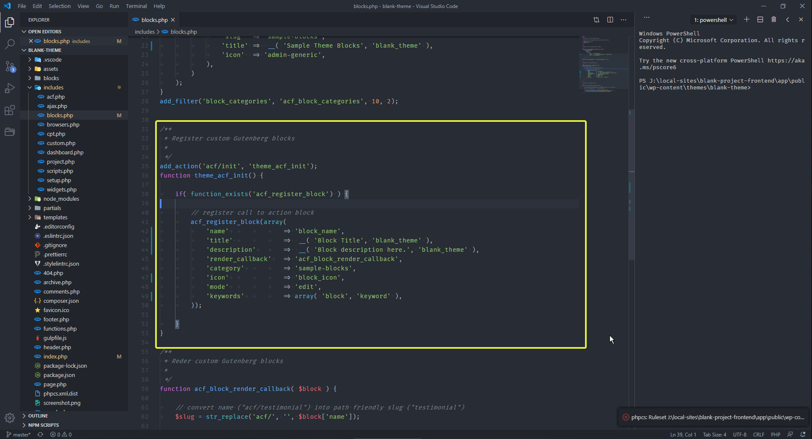
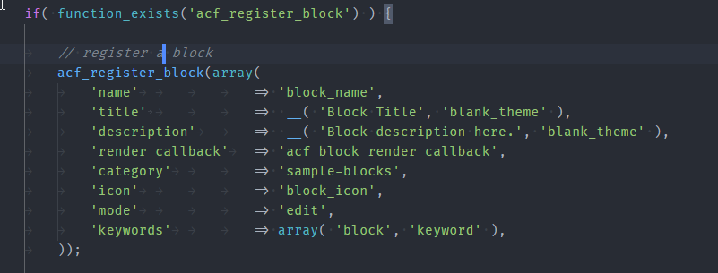
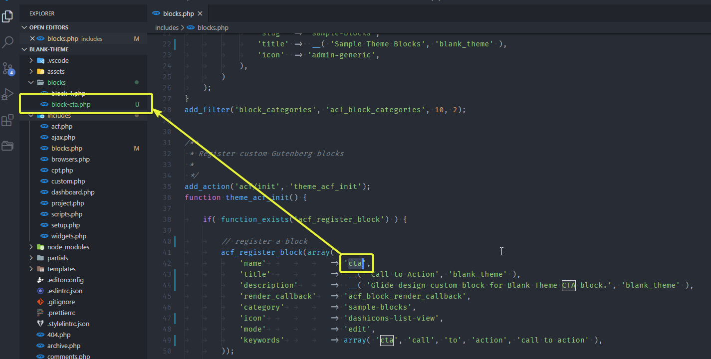
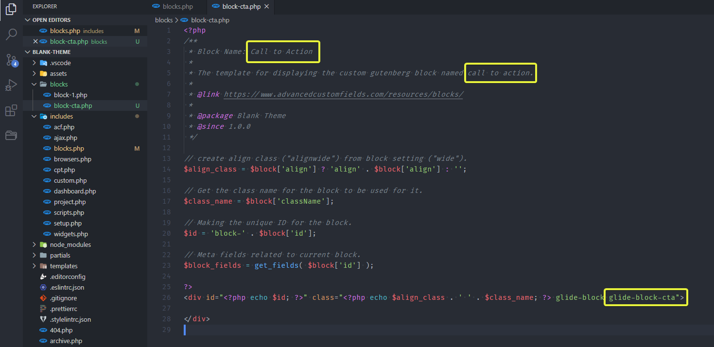
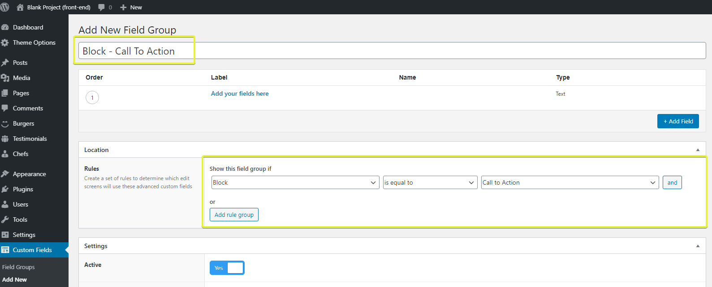
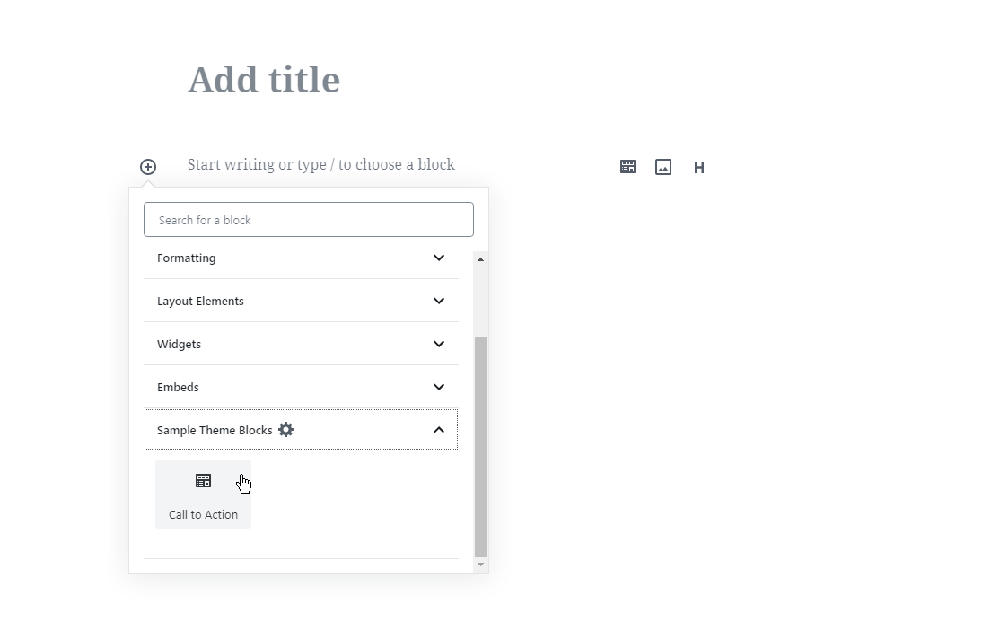
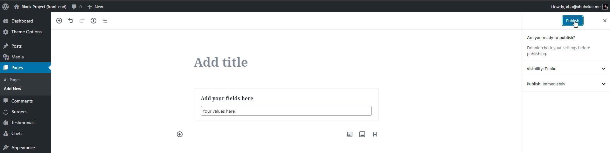

# Guten Block - WordPress Backend

> ***Note*** In this checklist you will learn how to add a new block into the backend from scratch till end.

## 1. Registering Block in WordPress

* First goto `includes > blocks.php`
* Find the place where default block has been added. 
* Update these things for new block. Don't chnage anything else or the block may disappear from backend options. 
  * Name
  * Title
  * Description
  * Icon
  * Keywords

## 2. Making Block PHP file

* Now goto `main directory -> block`
* There will be a file named `block-1.php`, copy and paste this file to replicate this.
* Rename the newly generated file to your new block with this manner `block-name.php`. For example the name of the block is `cta` here so the file name will be `block-cta.php` 
* Open this file and change the details of this file according to new block. These are the things you need to change. 
  * Name
  * Description
  * Glide Block Class name

## 3. Registering into Advanced Custom Fields (ACF)

* Open ACF from WordPress side menu
* Click on `Add New` to add new field group.
* Add title to your new field with this scheme. `Block-YourName`. So in this example this will be `Block - Call to Action`.
* Add your required fields below the title.
* Connect the block by selecting `Block` in `Show this field group if` option and then selecting your block from last field so in this case it will be `Call to Action`. 
* Publish this to finalize the process on this end.

## 4. Adding block in CMS

* Add new page/post where you will add the block.
* Click on plus icon for adding a new block and then find or directly add your block. 
* Adding the block, populates the area with it's fields. Simply add values and press update to save the page/post.
