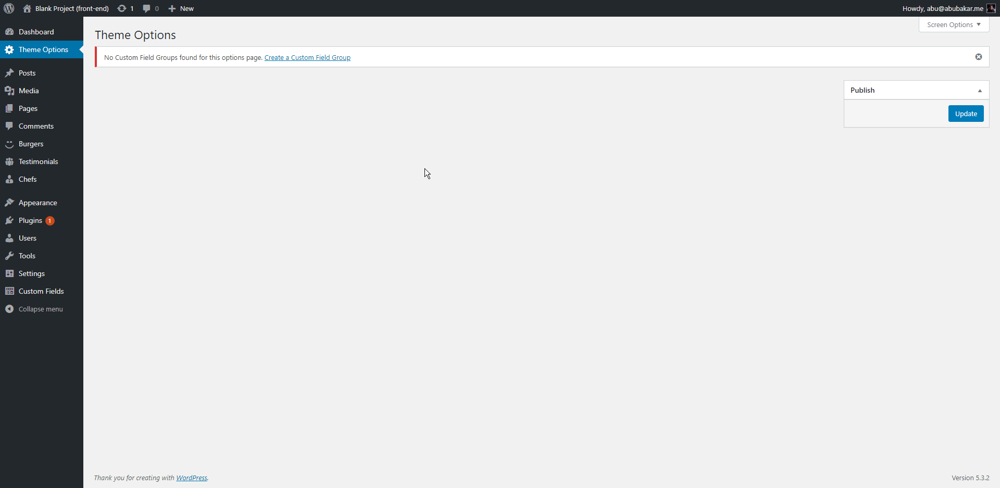
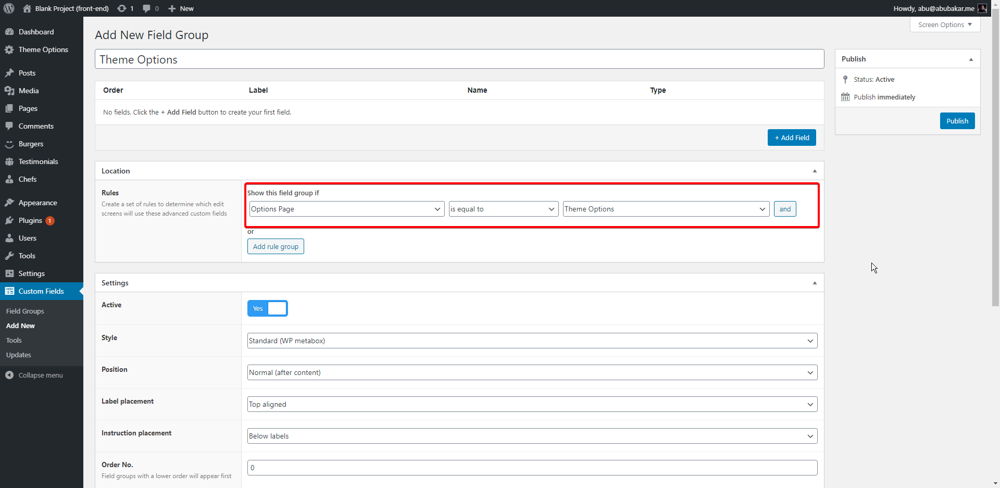
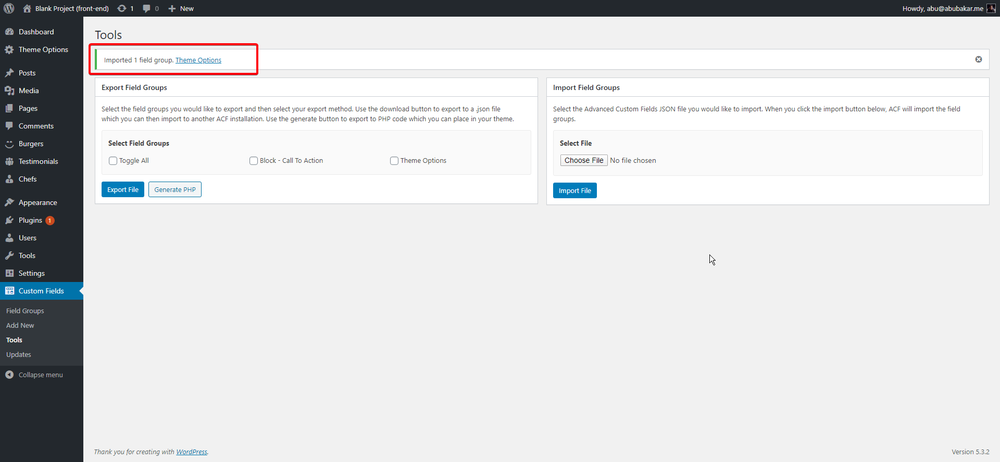
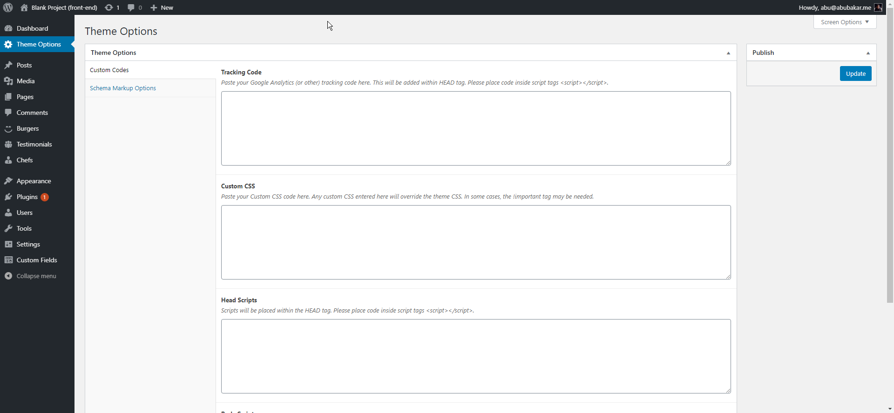
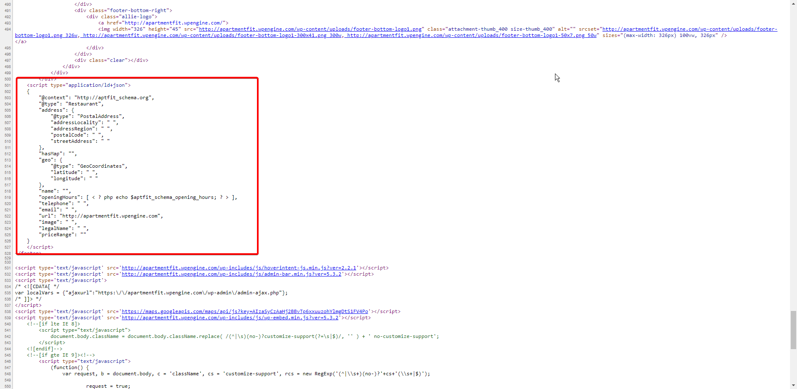

# Theme Options - WordPress Backend

> ***Note*** This checklist is about adding `Theme Options` in CMS of WordPress from start to end.

## 1. Adding in to functions.php file

* You need to navigate to your theme's functions.php file.
* Open `acf.php` file from there.
* Then add the following code there at any place. This will make the `Theme Options` panel visible in CMS.

	```php
	/**
		* Build ACF based theme options page
		*
		*/
	if( function_exists('acf_add_options_page') ) {
		$option_page = acf_add_options_page(array(
			'page_title' 	=> __( 'Theme Options', 'theme_textdomain' ),
			'menu_title' 	=> __( 'Theme Options', 'theme_textdomain' ),
			'menu_slug' 	=> 'acf-options',
			'capability' 	=> 'edit_posts',
			'redirect' 		=> false,
			'position'		=> 2
		));
	}
	```

* After that you will see that the `Theme Options` tab is available in CMS. After clicking on it opens up a page that have nothing to display yet. 

## 2. Adding options in it

* Open ACF and add new field.
* Name it `Theme Options`
* Select field group if to `Options Page` and select `Theme Opitons` from it. 
* Add your custom fields in the section above.

## 3. Importing already made fields

* You can import some specific fields that are already made and are being used in other projects.
* First go to [this repo](https://github.com/webriverteam/Must-Have-Project-Files).
* Download the file named `ACF - Export - Theme Opitons Tab.json` by viewing it in raw form.
* Go to your theme CMS, then ACF and finally click on `Tools`.
* In the `Import Field Groups` section, upload the file you just downloaded and click import.
* You will see the `Theme Options` field group is imported. 
* You can confirm the fields are imported by viewing the `Theme Options` tab in CMS. That should look like this now. 

## 4. Adding Code for Pre-Made fields in footer.php

> ***Note*** There are some fields that can be prepoulated in the ACF Theme Options panel. But you don't need to rewrite the code to output each and every one at every single time because right below the code is available for you to use where you want to output them.

### a. Header codes

* For all of these to work you need to place these variable calling before using these codes. So these will go at start of `<header>` tag in `header.php` file.
	```php
	<?php
		// Theme Options Varaibles
		$tracking = $option_fields['tracking_code'];
		$ccss     = $option_fields['custom_css'];
		$hscripts = $option_fields['head_scripts'];
		$bscripts = $option_fields['body_scripts'];
	?>
	```

* In `Theme Options` there is a `Custom Codes` section that contains some codes to be used. Here is code for 3 of these that you need to place at the end of `<header>` tag in `header.php` file.

	```php
		<?php
			// Add Tracking Code
		if ( $tracking != '' ) {
			echo $tracking;
		}

			// Add Custom CSS
		if ( $ccss != '' ) {
			echo '<style type="text/css">';
			echo $ccss;
			echo '</style>';
		}

			// Add Head Scripts
		if ( $hscripts != '' ) {
			echo $hscripts;
		}
		?>
	```

* For the options `Body Scripts` you need to place this code around start of `<body>` tag in `header.php` file.

	```php
		<?php
			if ( $bscripts != '' ) {
				echo $bscripts;
			}
		?>
	```

### b. Footer Codes

* Same as before, you need to call the variables before using them. So place this code in `footer.php` file to get values of all the variables.

	```php
	<?php
		// Schema Markup - Advanced custom fields variables.
		$schema_locality            = $option_fields['locality'];
		$schema_region              = $option_fields['region'];
		$schema_postal_code         = $option_fields['postal_code'];
		$schema_street_address      = $option_fields['street_address'];
		$schema_map_short_link      = $option_fields['map_short_link'];
		$schema_latitude            = $option_fields['latitude'];
		$schema_longitude           = $option_fields['longitude'];
		$schema_business_name       = $option_fields['business_name'];
		$schema_opening_hours       = $option_fields['opening_hours'];
		$schema_telephone           = $option_fields['telephone'];
		$schema_business_email      = $option_fields['business_email'];
		$schema_business_image_logo = $option_fields['business_image_logo'];
		$schema_business_legal_name = $option_fields['business_legal_name'];
		$schema_price_range         = $option_fields['price_range'];
	?>

* Goto `footer.php` and find `<?php wp_footer(); ?>` code.
* Paste these provided set of code lines below this to output the **Schema Markup** of site in footer.

	```javascript
		<script type="application/ld+json">
		{
			"@context": "http://schema.org",
			"@type": "Restaurant",
			"address": {
				"@type": "PostalAddress",
				"addressLocality": "<?php echo $schema_locality; ?> ",
				"addressRegion": "<?php echo $schema_region; ?> ",
				"postalCode": "<?php echo $schema_postal_code; ?> ",
				"streetAddress": "<?php echo $schema_street_address; ?> "
			},

			"hasMap": "<?php echo $schema_map_short_link; ?>",
			"geo": {
				"@type": "GeoCoordinates",
				"latitude": "<?php echo $schema_latitude; ?> ",
				"longitude": "<?php echo $schema_longitude; ?> "
			},

			"name": "<?php echo $schema_business_name; ?>",

			"openingHours": [ <
				?
				php echo $schema_opening_hours; ? >
			],

			"telephone": "<?php echo $schema_telephone; ?> ",
			"email": "<?php echo $schema_business_email; ?> ",
			"url": "<?php echo esc_url( home_url() ); ?>",
			"image": "<?php echo $schema_business_image_logo; ?> ",
			"legalName": "<?php echo $schema_business_legal_name; ?> ",
			"priceRange": "<?php echo $schema_price_range; ?>"
		}
		</script>
	```
* Now all of the fields being used in `Theme options` panel are being outputed in your project at proper places.

### c. Check code output

* For that you need to first add some values to your fields first so that can be used.
* Now open the project's any page in browser.
* Now press `Ctrl+u` **OR** press `right click` &rightarrow; `View page source` to view the code for that file.
* Now go to proper places to check the code being used in files. Here is a screenshot example. 
